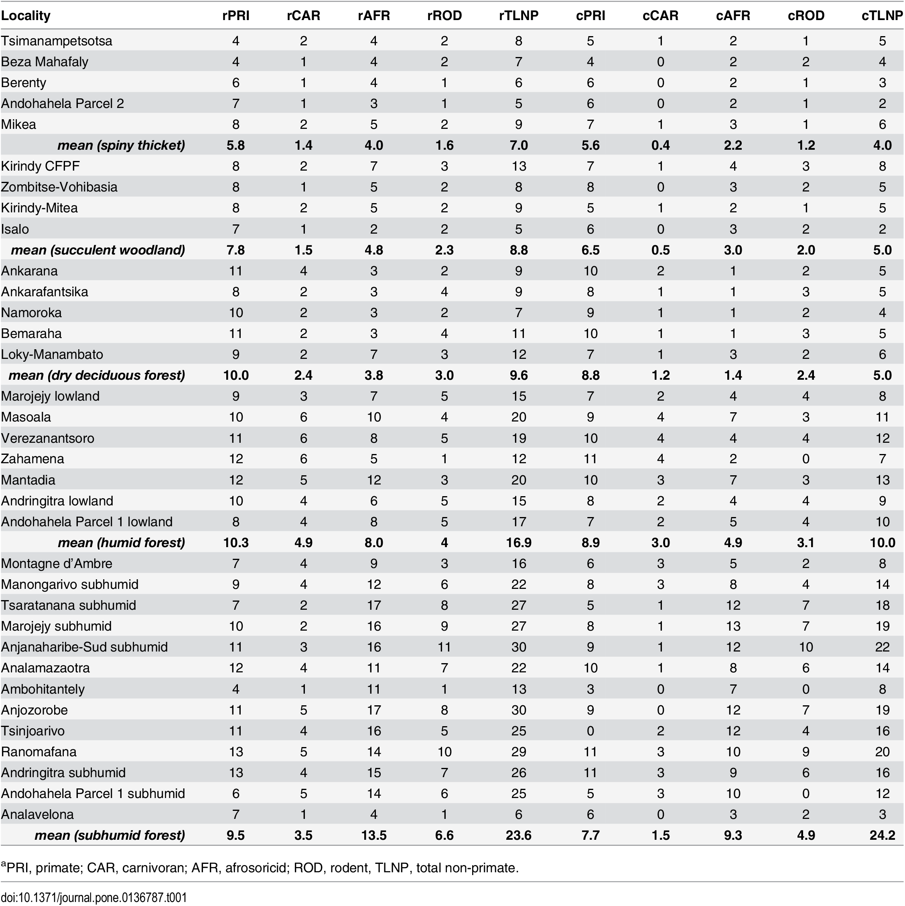
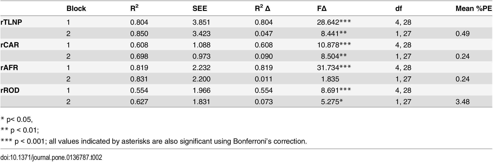
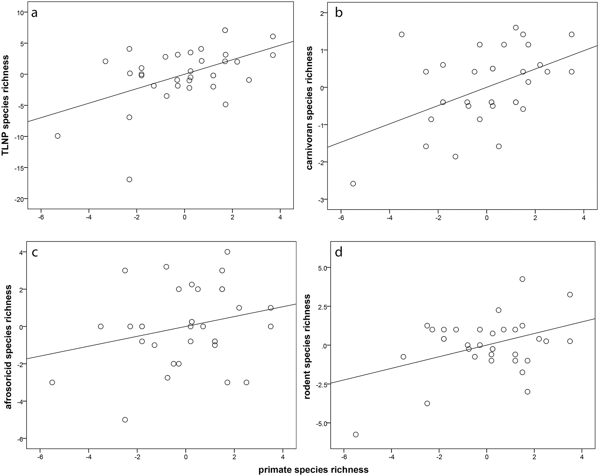

```{r setup, include=FALSE}
knitr::opts_chunk$set(
	echo = TRUE,
	warning = TRUE,
	message = TRUE,
	comment = "##",
	prompt = FALSE,
	tidy = TRUE,
	tidy.opts = list(blank = FALSE, width.cutoff = 75),
	fig.path = "img/",
	fig.align = "center"
)
```

##Replication of Analyses From *Primates as Predictors of Mammal Community Diversity in the Forest Ecosystems of Madagascar*

## Introduction

This paper aims to show how affective a more widely studied species like Primates can predict other mammal species' richness. Based in Madagascar, this study used lemurs as its predictor and aimed to show how well they could predict the richness of mammals suchs as rodents, carnivores, and afrosoricids. They concluded that primate species richness was a good predictor for carnivores and rodents after habitat was controlled for. This study is important for gaining information about lesser studied species and the general biodiversity that exists in environments. 

## Visualization of Data

This study performed various statistical analyses. For the descriptive statistical analysis I replicated Table 1 where the mean was found for each species group (PRI-Primate, CAR-Carnivore, AFR-Afrosoricid, ROD-Rodent, TLNP-Total non-primate) in the 5 different ecoregions (Spiny Thicket, Succulent Woodland, Dry Deciduous Forest, Humid Forest, Subhumid Forest) from "Table A". For the inferential statistical analysis I replicated Table 2 where a Multiple Linear Regression was performed to determine how well the species richness of Primates could predict other species richness. In this linear regression, the other predictor variable was ecoregion, a categorical variable, which had to be dummy-coded. For the visualization I replicated Figure 2, including 4 partial regression plots of species richness on primate species richness. 


```{r filea}
library(readxl)
f <- "~/Desktop/Species_Richness_Data.xlsx"
a <- read_excel(f, sheet = 1, col_names = TRUE)
head(a)
```

I had to go back to the excel sheet and and delete the first 3 rows (blank + ecoregion label) because R was reading the column names as numbers causing issues with subsetting specific data. Even when I jsut deleted the top two blank rows, R kept assigning numbers to the end of each ecoregion, continuing to make it unable for me to subset easily. This is the data without the three blank rows I used.


```{r fileA}
library(readxl)
f <- "~/Desktop/TableA.xlsx"
A <- read_excel(f, sheet = 1, col_names = TRUE)
head(A)
```

## Replications/Reanalysis

### Table 1 Reanalysis- Descriptive Statistical Analysis

The first analyses to be done was replicating the species richness data in Table 1

```{r library, echo=FALSE}
library(tidyr)
library(tidyverse)
library(dplyr)
library(readr)
library(knitr)
library(formatR)
```

#####*SPINY THICKET*
```{r Table_1_spiny}
rPRI<- A[1:73,c(8:11,36)]
rPRI<-colSums(rPRI)
as.data.frame(rPRI)
rCAR<- A[76:87,c(8:11,36)]
rCAR<-colSums(rCAR)
as.data.frame(rCAR)
rAFR<- A[90:120,c(8:11,36)]
rAFR<-colSums(rAFR)
as.data.frame(rAFR)
rROD<- A[123:146,c(8:11,36)]
rROD<-colSums(rROD)
as.data.frame(rROD)
rTLNP<- A[c(76:87,90:120,123:146),c(8:11,36)]
rTLNP<-colSums(rTLNP)
as.data.frame(rTLNP)
SP<- cbind(rPRI,rCAR,rAFR,rROD,rTLNP)
mean_spiny_thicket<-colMeans(SP)
SP<- rbind(SP,mean_spiny_thicket)
SP<- rbind(SP)
```

#####*SUCCULENT WOODLAND*
```{r Table_1_succ}
rPRI<- A[1:73,c(6:7,33:34)]
rPRI<-colSums(rPRI)
as.data.frame(rPRI)
rCAR<- A[76:87,c(6:7,33:34)]
rCAR<-colSums(rCAR)
as.data.frame(rCAR)
rAFR<- A[90:120,c(6:7,33:34)]
rAFR<-colSums(rAFR)
as.data.frame(rAFR)
rROD<- A[123:146,c(6:7,33:34)]
rROD<-colSums(rROD)
as.data.frame(rROD)
rTLNP<- A[c(76:87,90:120,123:146),c(6:7,33:34)]
rTLNP<-colSums(rTLNP)
as.data.frame(rTLNP)
SUC<- cbind(rPRI,rCAR,rAFR,rROD,rTLNP)
mean_succulent_woodland<-colMeans(SUC)
SUC<- rbind(SUC,mean_succulent_woodland)
TABLE1<- rbind(SP,SUC)
```

#####*DRY DECIDUOUS FOREST*
```{r Table_1_dry}
rPRI<- A[1:73,c(2:5,31)]
rPRI<-colSums(rPRI)
as.data.frame(rPRI)
rCAR<- A[76:87,c(2:5,31)]
rCAR<-colSums(rCAR)
as.data.frame(rCAR)
rAFR<- A[90:120,c(2:5,31)]
rAFR<-colSums(rAFR)
as.data.frame(rAFR)
rROD<- A[123:146,c(2:5,31)]
rROD<-colSums(rROD)
as.data.frame(rROD)
rTLNP<- A[c(76:87,90:120,123:146),c(2:5,31)]
rTLNP<-colSums(rTLNP)
as.data.frame(rTLNP)
DRY<- cbind(rPRI,rCAR,rAFR,rROD,rTLNP)
mean_dry_deciduous_forest<-colMeans(DRY)
DRY<- rbind(DRY,mean_dry_deciduous_forest)
TABLE1<-rbind(SP,SUC,DRY)
```

#####*HUMID FOREST*
```{r Table_1_humid}
rPRI<- A[1:73,c(24:30)]
rPRI<-colSums(rPRI)
as.data.frame(rPRI)
rCAR<- A[76:87,c(24:30)]
rCAR<-colSums(rCAR)
as.data.frame(rCAR)
rAFR<- A[90:120,c(24:30)]
rAFR<-colSums(rAFR)
as.data.frame(rAFR)
rROD<- A[123:146,c(24:30)]
rROD<-colSums(rROD)
as.data.frame(rROD)
rTLNP<- A[c(76:87,90:120,123:146),c(24:30)]
rTLNP<-colSums(rTLNP)
as.data.frame(rTLNP)
HUM<- cbind(rPRI,rCAR,rAFR,rROD,rTLNP)
mean_humid_forest<-colMeans(HUM)
HUM<- rbind(HUM,mean_humid_forest)
TABLE1<- rbind(SP,SUC,DRY,HUM)
```

#####*SUBHUMID FOREST*
```{r Table_1_subhumid}
rPRI<- A[1:73,c(12:23,35)]
rPRI<-colSums(rPRI)
as.data.frame(rPRI)
rCAR<- A[76:87,c(12:23,35)]
rCAR<-colSums(rCAR)
as.data.frame(rCAR)
rAFR<- A[90:120,c(12:23,35)]
rAFR<-colSums(rAFR)
as.data.frame(rAFR)
rROD<- A[123:146,c(12:23,35)]
rROD<-colSums(rROD)
as.data.frame(rROD)
rTLNP<- A[c(76:87,90:120,123:146),c(12:23,35)]
rTLNP<-colSums(rTLNP)
as.data.frame(rTLNP)
SUB<- cbind(rPRI,rCAR,rAFR,rROD,rTLNP)
mean_subhumid_forest<-colMeans(SUB)
SUB<- rbind(SUB,mean_subhumid_forest)
TABLE1<- rbind(SP,SUC,DRY,HUM,SUB)
TABLE1<-as.data.frame(TABLE1)
```

####Final Table 1
```{r echo=FALSE, results='asis'}
kable(TABLE1)
```

####Table 1 from Study





A few discrepancies can be found when comparing my replication to the one in the study. First,for the Subhumid forest measures, the authors and I came up with the same values for rPRI, rCAR, rAFR, rROD, and rTLNP, but different means. Second, for rTLNP Bemaraha I came up with 9 and they with 11, and with rTLNP Kirindy CFPF I came up with 12 and they 13. However, I continued to use the values I came up with throughout this project, and came up with the same results. Lastly, for rPRI Tsimanampetsotsa I reported 5 from the dataset, and they reported 4; for Andohahela Parcel 2 I reported 6 and they reported 7; for Ankarafantsika I reported 9 and they reported 8. I went back to the dataset and am still not sure how they came up with those values. Further in the report, you will see where I did have to change my values to the ones they reported in the study in order to get the appropriate statistical analyses run and figures made.


***Ambohijanahary was included in the datasets, but was never used in the analyses

###Table 2 Reanalysis- Inferential statistical analysis

```{r lib table 2}
library(car)
library(tidyverse)
```

```{r fixing table for next analy}
Table2<- TABLE1
Table2
df<- as.data.frame(Table2)
is.data.frame(df)
df<-df[-c(6,11,17,25,39),]
```

#####*DUMMY CODING ECOREGION*
```{r dummy code ecoregion}
df<- cbind(df, ecoregion=c("Spiny Thicket","Spiny Thicket","Spiny Thicket","Spiny Thicket","Spiny Thicket","Succulent Woodland","Succulent Woodland","Succulent Woodland","Succulent Woodland","Dry Deciduous Forest","Dry Deciduous Forest","Dry Deciduous Forest","Dry Deciduous Forest","Dry Deciduous Forest","Humid Forest","Humid Forest","Humid Forest","Humid Forest","Humid Forest","Humid Forest","Humid Forest","Subhumid Forest","Subhumid Forest","Subhumid Forest","Subhumid Forest","Subhumid Forest","Subhumid Forest","Subhumid Forest","Subhumid Forest","Subhumid Forest","Subhumid Forest","Subhumid Forest","Subhumid Forest","Subhumid Forest"))
df
str(df$ecoregion)
```

#####*FINDING AND REMOVING THOSE WHERE Di > 4/n (4/34)*

The authors stated that "we removed outliers from the analysis if Di > 4 / n, where n = 34". Analevelona (row 34) was the only one to fit this, which can be seen in the Cook's Distance test below. The authors also stated later in the results that "for the remaining analyses, we removed this community [Analevelona] from our sample".

```{r cooks dist}
library(olsrr)
m<-lm(data=df,rTLNP ~ ecoregion + rPRI)
ols_plot_cooksd_chart(m)
df<-df[-c(34),] #removing Analevelona
```


```{r table lib for modeling }
library(AutoModel)
```

#####*TLNP vs. PRI*
```{r model 1}
run_model("rTLNP", c("ecoregion"), c("rPRI"), dataset = df)
```

#####*CAR vs PRI*
```{r model 2}
run_model("rCAR", c("ecoregion"), c("rPRI"), dataset = df)
```

#####*AFR vs PRI*
```{r model 3}
run_model("rAFR", c("ecoregion"), c("rPRI"), dataset = df)
```

#####*ROD vs PRI*
```{r model 4}
run_model("rROD", c("ecoregion"), c("rPRI"), dataset = df)
```

These reanalyses did not produce the same results as the study. when looking at ecoregion alone as the predictor variable, the results came out good. However, when the regression was run with both ecoregion and rPRI, the statistical values weren't matching. I then realized it was likely the discrepancy I discussed earlier with the author and I having different rPRI values for Tsimanampetsotsa, Andohahela Parcel 2, and Ankarafantsika. I address this issue below.

###TABLE 2 Redone With rPRI numbers used by authors

This is where I have had to change my rPRI numbers to match their in order to get the appropriate summary reports/ statistics. I have done some steps over again to ensure I didn't mess up my data frame (i.e. remove rows that were mean values, dummy code ecoregion, perform Cook's Distance, and remove Analavelona from analysis), but I did not have these echoed, as I have run them a couple of times already.

```{r retry, echo=FALSE}
TABLE2<- TABLE1
TABLE2
df<- as.data.frame(TABLE2)
is.data.frame(df)
df<-df[-c(6,11,17,25,39),]

#####*DUMMY CODING ECOREGION*

df<- cbind(df, ecoregion=c("Spiny Thicket","Spiny Thicket","Spiny Thicket","Spiny Thicket","Spiny Thicket","Succulent Woodland","Succulent Woodland","Succulent Woodland","Succulent Woodland","Dry Deciduous Forest","Dry Deciduous Forest","Dry Deciduous Forest","Dry Deciduous Forest","Dry Deciduous Forest","Humid Forest","Humid Forest","Humid Forest","Humid Forest","Humid Forest","Humid Forest","Humid Forest","Subhumid Forest","Subhumid Forest","Subhumid Forest","Subhumid Forest","Subhumid Forest","Subhumid Forest","Subhumid Forest","Subhumid Forest","Subhumid Forest","Subhumid Forest","Subhumid Forest","Subhumid Forest","Subhumid Forest"))
df
str(df$ecoregion)

#####*FINDING AND REMOVING THOSE WHERE Di > 4/n (4/34): "We removed outliers from the analysis if Di > 4 / n, where n = 34 (i.e., the number of mammal communities,"*

m<-lm(data=df,rTLNP ~ ecoregion + rPRI)
ols_plot_cooksd_chart(m)
df<-df[-c(34),]

#####*REMOVE ANALAVELONA FROM ANALYSIS*
```

#####*INSERTING VALUES WE HAD THAT WERE DIFFERENT*

```{r rPRI values}
df[1,1]<-4
df[4,1]<-7
df[11,1]<-8
df
```

#####*TLNP vs PRI*
```{r retry model 1}
rTLNP_STATS<-run_model("rTLNP", c("ecoregion"), c("rPRI"), dataset = df)
rTLNP_STATS<-rTLNP_STATS$SummaryDF
```

#####*CAR vs PRI*
```{r retry model 2}
rCAR_STATS<-run_model("rCAR", c("ecoregion"), c("rPRI"), dataset = df)
rCAR_STATS<-rCAR_STATS$SummaryDF
```

#####*AFR vs PRI*
```{r retry model 3}
rAFR_STATS<-run_model("rAFR", c("ecoregion"), c("rPRI"), dataset = df)
rAFR_STATS<-rAFR_STATS$SummaryDF
```

#####*ROD vs PRI*
```{r retry mdel 4}
rROD_STATS<- run_model("rROD", c("ecoregion"), c("rPRI"), dataset = df)
rROD_STATS<-rROD_STATS$SummaryDF
```

####MAKING FINAL VERION OF TABLE 2
```{r finalTable2}
rTLNP_STATS<- rTLNP_STATS[,c("R2","SE","DeltaR2","Fch","DF1","DF2","pval")]
rCAR_STATS<- rCAR_STATS[,c("R2","SE","DeltaR2","Fch","DF1","DF2","pval")]
rAFR_STATS<- rAFR_STATS[,c("R2","SE","DeltaR2","Fch","DF1","DF2","pval")]
rROD_STATS<- rROD_STATS[,c("R2","SE","DeltaR2","Fch","DF1","DF2","pval")]
TABLE2<- rbind(rTLNP_STATS,rCAR_STATS,rAFR_STATS,rROD_STATS)
row.names(TABLE2)<- c("rTLNP","  ","rCAR","   ","rAFR","    ","rROD","     ")
TABLE2<- cbind(TABLE2, Block=c("1","2","1","2","1","2","1","2"))
TABLE2<-TABLE2[c(8,1,2,3,4,5,6,7)]
colnames(TABLE2)[5]<- "DeltaF"
TABLE2
```

###Final Table 2
```{r echo=FALSE, results='asis'}
kable(TABLE2)
```

###Table 2 from study



There was one slight discrepancy when comparing my replicated Table 2 to their Table 2. If you look at rCAR Block 2 DeltaF, you will see my reanalysis statistic was 8.0542 and there statistic was 8.504.


###FIGURE 2- Visualization

Even though the Multiple Regression Analysis has been run with the rPRI values the authors used, I still wanted to make Partial Regression Plots of the data I replicated. In the section following I will adjust the values back to the ones the authors used for rPRI

```{r fig 2 with my data}
TABLE2<- TABLE1
TABLE2
df_figure<- as.data.frame(TABLE2)
is.data.frame(df_figure)
df_figure<-df_figure[-c(6,11,17,25,39),]
df_figure<- cbind(df_figure, ecoregion=c("Spiny Thicket","Spiny Thicket","Spiny Thicket","Spiny Thicket","Spiny Thicket","Succulent Woodland","Succulent Woodland","Succulent Woodland","Succulent Woodland","Dry Deciduous Forest","Dry Deciduous Forest","Dry Deciduous Forest","Dry Deciduous Forest","Dry Deciduous Forest","Humid Forest","Humid Forest","Humid Forest","Humid Forest","Humid Forest","Humid Forest","Humid Forest","Subhumid Forest","Subhumid Forest","Subhumid Forest","Subhumid Forest","Subhumid Forest","Subhumid Forest","Subhumid Forest","Subhumid Forest","Subhumid Forest","Subhumid Forest","Subhumid Forest","Subhumid Forest","Subhumid Forest"))
df_figure
df_figure<-df_figure[-c(34),]
```

#####*Fig2a*
```{r fig2a}
avPlots(lm(rTLNP ~ ecoregion+rPRI ,data=df_figure),grid=FALSE,id=FALSE, terms = "rPRI")
```

#####*Fig2b*
```{r fig2b}
avPlots(lm(rCAR ~ ecoregion+rPRI ,data=df_figure),grid=FALSE,id=FALSE, terms = "rPRI")
```

#####*Fig2c*
```{r fig2c}
avPlots(lm(rAFR ~ ecoregion+rPRI ,data=df_figure),grid=FALSE,id=FALSE, terms = "rPRI")
```

#####*Fig2d*
```{r fig2d}
avPlots(lm(rROD ~ ecoregion+rPRI ,data=df_figure),grid=FALSE,id=FALSE, terms = "rPRI")
```


##Figure 2 Reanalysis with adjusted rPRI values

```{r author val}
Figure2_values<- TABLE1
Figure2_values
df_figure<- as.data.frame(Figure2_values)
df_figure<-df_figure[-c(6,11,17,25,39),]
df_figure<- cbind(df_figure, ecoregion=c("Spiny Thicket","Spiny Thicket","Spiny Thicket","Spiny Thicket","Spiny Thicket","Succulent Woodland","Succulent Woodland","Succulent Woodland","Succulent Woodland","Dry Deciduous Forest","Dry Deciduous Forest","Dry Deciduous Forest","Dry Deciduous Forest","Dry Deciduous Forest","Humid Forest","Humid Forest","Humid Forest","Humid Forest","Humid Forest","Humid Forest","Humid Forest","Subhumid Forest","Subhumid Forest","Subhumid Forest","Subhumid Forest","Subhumid Forest","Subhumid Forest","Subhumid Forest","Subhumid Forest","Subhumid Forest","Subhumid Forest","Subhumid Forest","Subhumid Forest","Subhumid Forest"))
df_figure<-df_figure[-c(34),]
df_figure[1,1]<-4
df_figure[4,1]<-7
df_figure[11,1]<-8
df_figure
```

#####*Fig2a*
```{r auth fig2a}
par(mfrow=c(2,2))
avPlots(lm(rTLNP ~ ecoregion+rPRI ,data=df_figure),grid=FALSE,id=FALSE, terms = "rPRI",xlab="Primate Species Richness",ylab="TLNP Species Richness",ylim=c(-20,10), xlim=c(-6,4))
text(-6,9,labels = "a")

avPlots(lm(rCAR ~ ecoregion+rPRI ,data=df_figure),grid=FALSE,id=FALSE, terms = "rPRI",xlab="Primate Species Richness",ylab="Carnivoran Species Richness",ylim=c(-3,2), xlim=c(-6,4))
text(-6,2,labels = "b")

avPlots(lm(rAFR ~ ecoregion+rPRI ,data=df_figure),grid=FALSE,id=FALSE, terms = "rPRI",xlab="Primate Species Richness",ylab="Afrosoricid Species Richness",ylim=c(-6,4), xlim=c(-6,4))
text(-6,4,labels = "c")

avPlots(lm(rROD ~ ecoregion+rPRI ,data=df_figure),grid=FALSE,id=FALSE, terms = "rPRI",xlab="Primate Species Richness",ylab="Rodent Species Richness",ylim=c(-6,6), xlim=c(-6,4))
text(-6,6,labels = "d")
```

After looking at the Figures, I found that Figure 2a was still not what the authors had come up with. After some searching, I discovered that they had included Analevelona into their analysis just for Figure 2a, but not Figure 2 b-d. What I have done is rerun the analysis by including Analevelona when making Figure 2a, and then I omit it in order to run plots b-d properly. The end result are 4 graphs that match those in the study.

####REDOING FIGURE 2 to include Analevelona data in Fig 2a (TLNP vs Primate)
```{r Ana add for fig2a, echo=FALSE}
Figure2_values<- TABLE1
df_figure<- as.data.frame(Figure2_values)
df_figure<-df_figure[-c(6,11,17,25,39),]
df_figure<- cbind(df_figure, ecoregion=c("Spiny Thicket","Spiny Thicket","Spiny Thicket","Spiny Thicket","Spiny Thicket","Succulent Woodland","Succulent Woodland","Succulent Woodland","Succulent Woodland","Dry Deciduous Forest","Dry Deciduous Forest","Dry Deciduous Forest","Dry Deciduous Forest","Dry Deciduous Forest","Humid Forest","Humid Forest","Humid Forest","Humid Forest","Humid Forest","Humid Forest","Humid Forest","Subhumid Forest","Subhumid Forest","Subhumid Forest","Subhumid Forest","Subhumid Forest","Subhumid Forest","Subhumid Forest","Subhumid Forest","Subhumid Forest","Subhumid Forest","Subhumid Forest","Subhumid Forest","Subhumid Forest"))
df_figure[1,1]<-4
df_figure[4,1]<-7
df_figure[11,1]<-8
df_figure
```


```{r updated fig2a}
par(mfrow=c(2,2))
avPlots(lm(rTLNP ~ ecoregion+rPRI ,data=df_figure),grid=FALSE,id=FALSE, terms = "rPRI",xlab="Primate Species Richness",ylab="TLNP Species Richness",ylim=c(-20,10), xlim=c(-6,4))
text(-6,9,labels = "a")

df_figure<-df_figure[-c(34),] #I am now omitting Analevelona in order to put together a final Figure 2 with each graph as it appears in the study

avPlots(lm(rCAR ~ ecoregion+rPRI ,data=df_figure),grid=FALSE,id=FALSE, terms = "rPRI",xlab="Primate Species Richness",ylab="Carnivoran Species Richness",ylim=c(-3,2), xlim=c(-6,4))
text(-6,2,labels = "b")

avPlots(lm(rAFR ~ ecoregion+rPRI ,data=df_figure),grid=FALSE,id=FALSE, terms = "rPRI",xlab="Primate Species Richness",ylab="Afrosoricid Species Richness",ylim=c(-6,4), xlim=c(-6,4))
text(-6,4,labels = "c")

avPlots(lm(rROD ~ ecoregion+rPRI ,data=df_figure),grid=FALSE,id=FALSE, terms = "rPRI",xlab="Primate Species Richness",ylab="Rodent Species Richness",ylim=c(-6,6), xlim=c(-6,4))
text(-6,6,labels = "d")
```

###Figure 2 from Study



#### Here are some bigger versions of the four graphs I replicated above for better reference
```{r Ana add for fig2a final, echo=FALSE}
Figure2_values<- TABLE1
df_figure<- as.data.frame(Figure2_values)
df_figure<-df_figure[-c(6,11,17,25,39),]
df_figure<- cbind(df_figure, ecoregion=c("Spiny Thicket","Spiny Thicket","Spiny Thicket","Spiny Thicket","Spiny Thicket","Succulent Woodland","Succulent Woodland","Succulent Woodland","Succulent Woodland","Dry Deciduous Forest","Dry Deciduous Forest","Dry Deciduous Forest","Dry Deciduous Forest","Dry Deciduous Forest","Humid Forest","Humid Forest","Humid Forest","Humid Forest","Humid Forest","Humid Forest","Humid Forest","Subhumid Forest","Subhumid Forest","Subhumid Forest","Subhumid Forest","Subhumid Forest","Subhumid Forest","Subhumid Forest","Subhumid Forest","Subhumid Forest","Subhumid Forest","Subhumid Forest","Subhumid Forest","Subhumid Forest"))
df_figure[1,1]<-4
df_figure[4,1]<-7
df_figure[11,1]<-8
```

```{r individual fig2a, echo=FALSE}
avPlots(lm(rTLNP ~ ecoregion+rPRI ,data=df_figure),grid=FALSE,id=FALSE, terms = "rPRI",xlab="Primate Species Richness",ylab="TLNP Species Richness",ylim=c(-20,10), xlim=c(-6,4))
text(-6,9,labels = "a")
```
```{r omit Analevelona, echo=FALSE}
df_figure<-df_figure[-c(34),] #I am now omitting Analevelona in order to put together a final Figure 2 with each graph as it appears in the study
```
```{r individual Fig2b, echo=FALSE}
avPlots(lm(rCAR ~ ecoregion+rPRI ,data=df_figure),grid=FALSE,id=FALSE, terms = "rPRI",xlab="Primate Species Richness",ylab="Carnivoran Species Richness",ylim=c(-3,2), xlim=c(-6,4))
text(-6,2,labels = "b")
```
```{r individual Fig2c, echo=FALSE}
avPlots(lm(rAFR ~ ecoregion+rPRI ,data=df_figure),grid=FALSE,id=FALSE, terms = "rPRI",xlab="Primate Species Richness",ylab="Afrosoricid Species Richness",ylim=c(-6,4), xlim=c(-6,4))
text(-6,4,labels = "c")
```
```{r individual Fig2d, echo=FALSE}
avPlots(lm(rROD ~ ecoregion+rPRI ,data=df_figure),grid=FALSE,id=FALSE, terms = "rPRI",xlab="Primate Species Richness",ylab="Rodent Species Richness",ylim=c(-6,6), xlim=c(-6,4))
text(-6,6,labels = "d")
```
